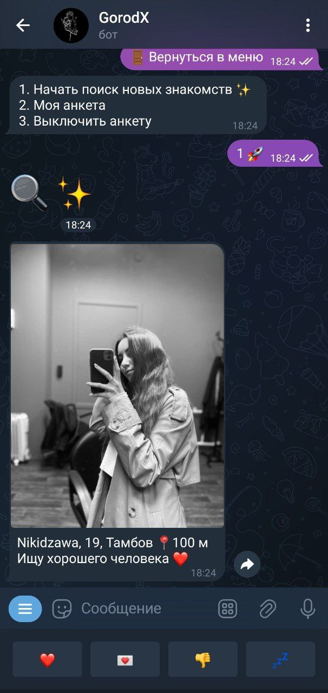
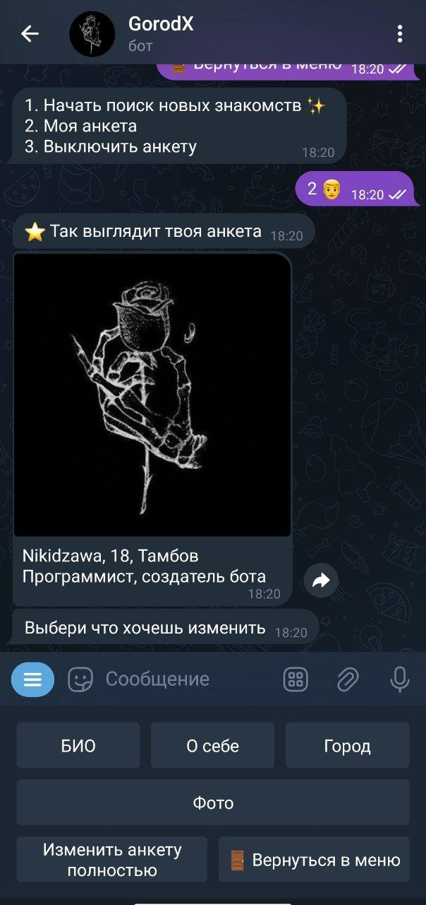
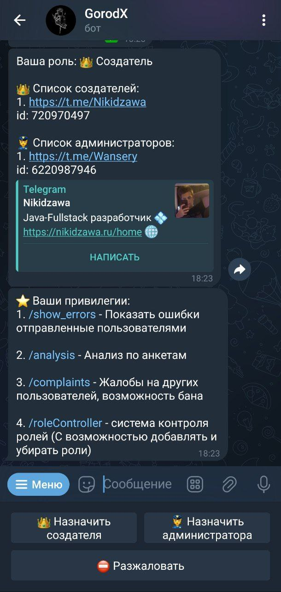

# GorodX

Телеграм бот для знакомств, аналог Tinder и Дайвнчик

@GorodX_HMAO_bot

## Умная система рекомендаций

Система рекомендаций буквально создана специально для того, чтобы найти тебе максимально подходящего человека. Она строится на:
* Физической близости (благодаря геокодированию, точность поиска может иметь погрешность меньше метра)
* Предпочтений в поиске (Парни, девушки или оба пола)
* Возраста

Во время просмотра анкет, у пользователя есть возможность просто лайкнуть человека, либо отправить ему послание. 
Это может быть 
* Текстовое сообщение
* Фотография 
* Видео
* Голосовое сообщение
* Кружок (особый формат коротких видео в Telegram)

## Профиль

Пользователь получает доступ к удобному и понятному интерфейсу

## Админ панель
В боте реализована админ панель с четким разделением полномочий, 
в которых разберётся даже человек далёкий от программирования

## Техническая часть

В боте реализовано много других классных фишек. Сочетание лучших паттернов программирования с передовыми технологиями, 
позволили добиться существенного быстродействия одновременно с лёгкостью масштабирования проекта и лёгкому взаимозаменяемостью отдельных компонентов. 
Для развёртывания, проект не требует серьёзных мощностей. Всё это, а так же любовь к своему творению и внимательность к деталям, выгодно отличает мой проект от конкурентов.

Стек проекта: 
* Java 21
* Spring Boot
* JPA, JPQL, Native Query
* PostgreSQL
* Redis
* Jackson
* Lombok
* Docker

API:
* Yandex Maps
* Open Street Map
